# Assessment: Use Case Oriented Project

## Task 1: Git Repository Setup
Create 3 branches:

-   development
-   testing
-   production


#### Step-1 Creating New github repo
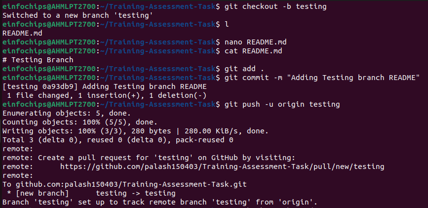

#### Step-2 Creating branches Develpment Testing and  Production

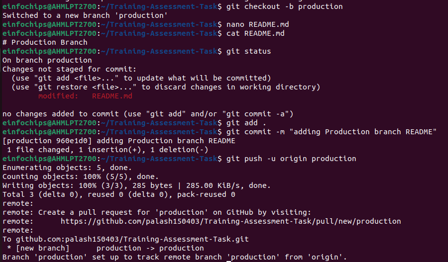

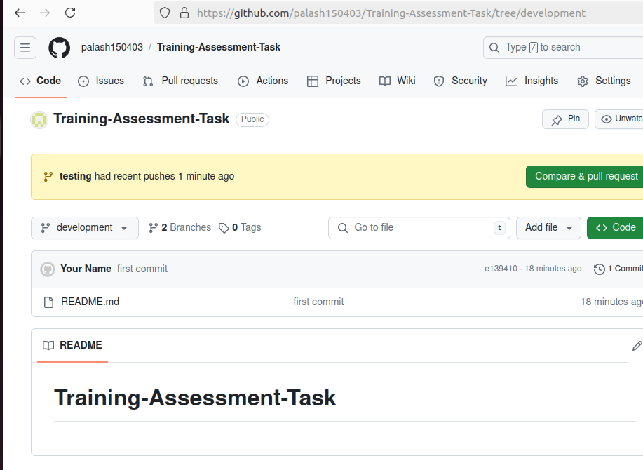
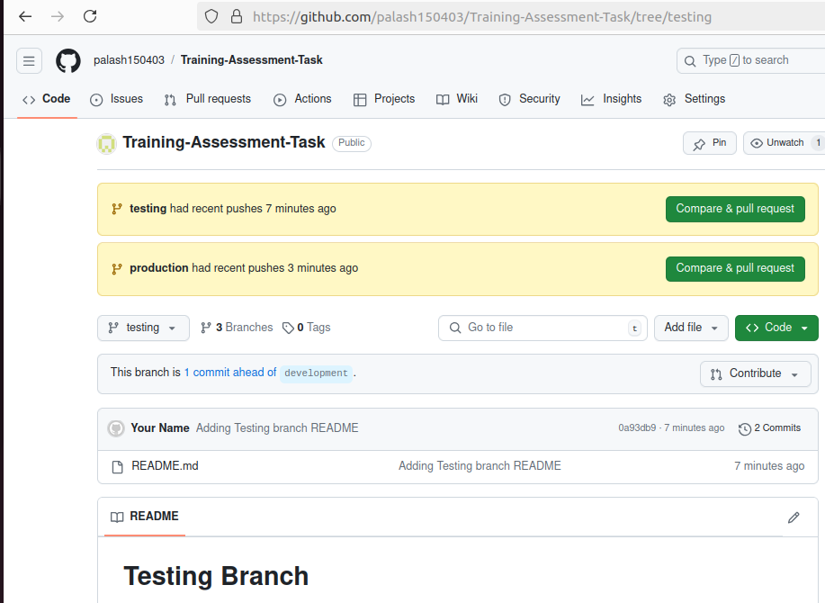
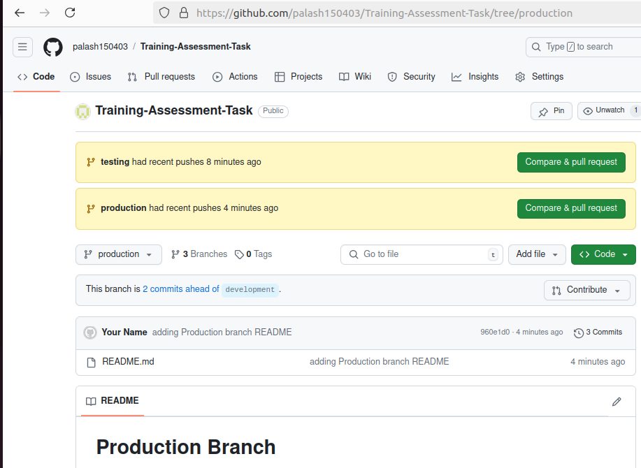
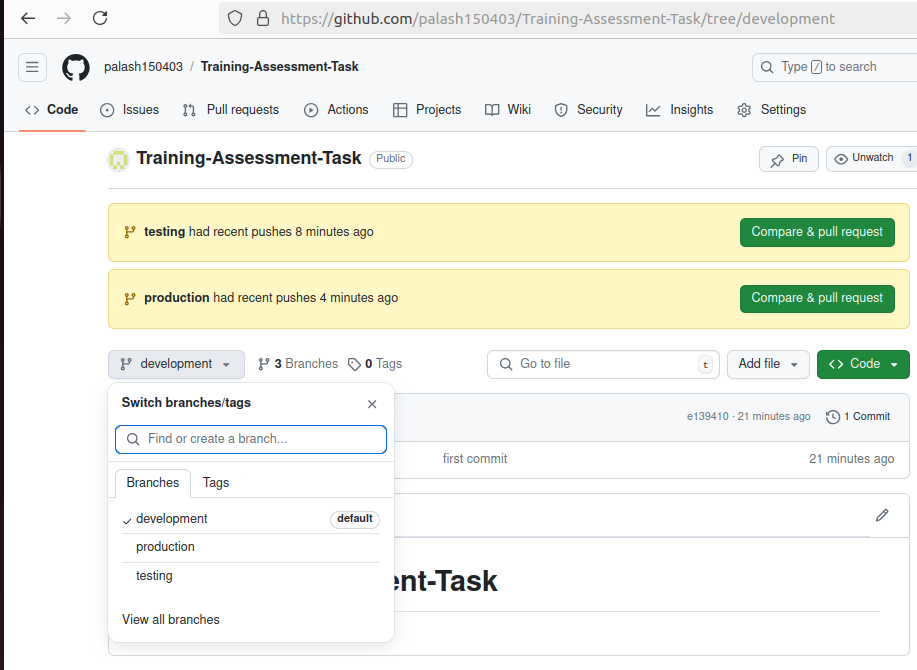
#### Step-3 Merging Branches

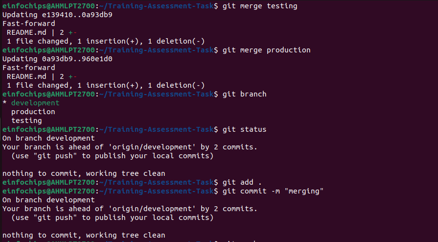
####

## Task 2: Dockerize Microservices
#### Now create a docker image for frontend 

-   Dockerfile

```
FROM nginx:latest
COPY index.html /usr/share/nginx/html/index.html
EXPOSE 80
```
-   building frontend image and then pushing it to dockerhub

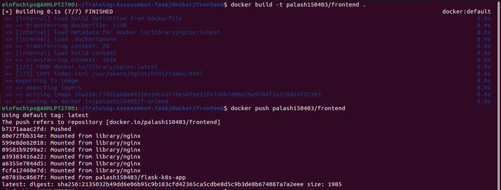

#### Now create a docker image for backend

```
FROM node:latest

WORKDIR /usr/src/app

COPY package*.json ./
RUN npm install

COPY . .

EXPOSE 3000
CMD ["node", "index.js"]
```
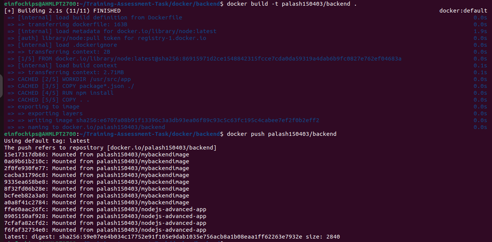

#### Now create a docker image for database
-   Dockerfile
```
FROM postgres:latest
ENV POSTGRES_USER=user
ENV POSTGRES_PASSWORD=password
ENV POSTGRES_DB=mydatabase
```
-   building backend image and then pushing it to dockerhub

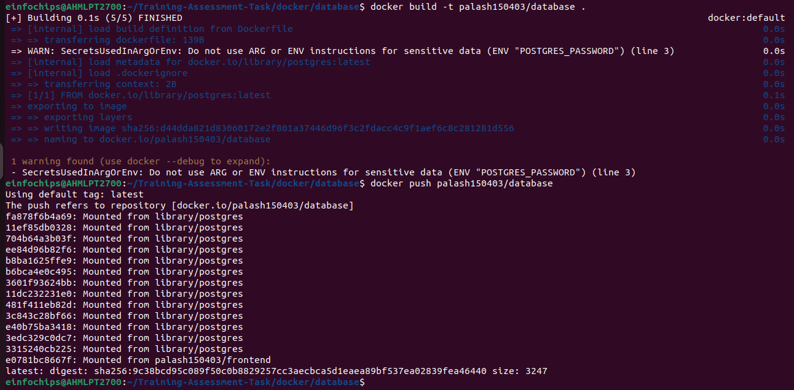
### Task-3 Kubernetes
-   Now deploying using kubernetes containerization.

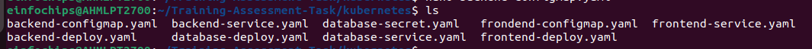

-   Now we will check the status of our pods and deployments

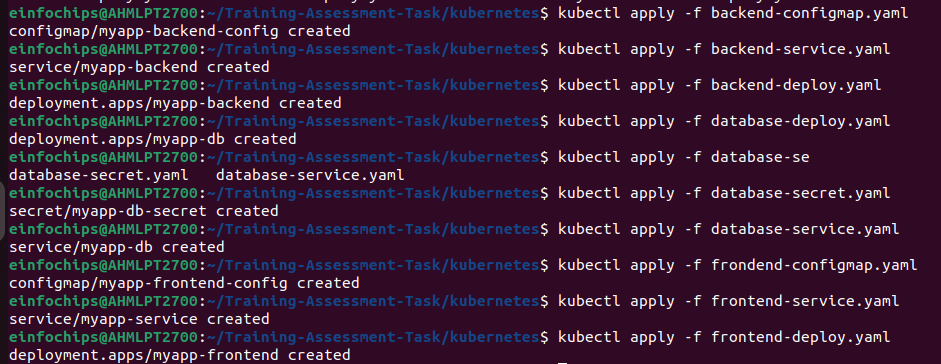

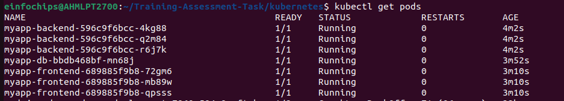

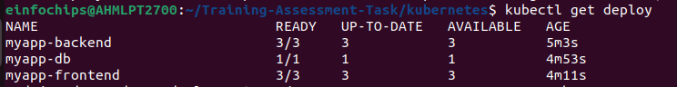

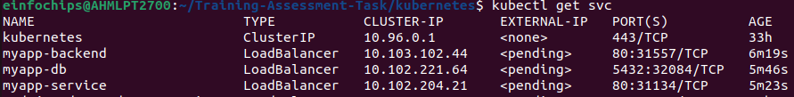

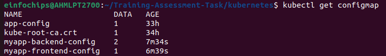

-   Checking the Live deployment on website

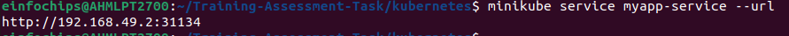

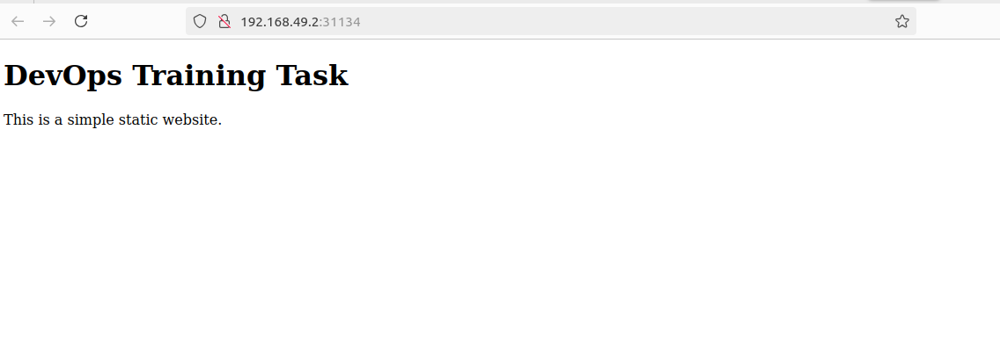

